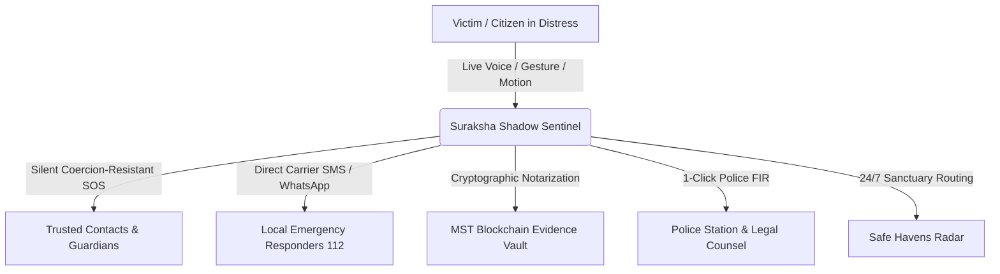

# 📋 Functional Requirements Document (FRD)
## 🛡️ Suraksha Shadow (सुरक्षा शैडो)
### Autonomous AI & Forensic Women/Citizen Safety Platform

---

| **Document Version** | 2.4.0 |
| **Status** | Approved / Production |
| **Target Audience** | Engineering Teams, Law Enforcement Liaisons, Legal Tech Evaluators, Hackathon Jury |
| **Classification** | Public & Open Source |
| **Last Updated** | September 2026 |

---

## 1. Executive Summary & Product Vision

**Suraksha Shadow** is an autonomous, privacy-first, anti-coercion emergency response and forensic evidence gathering platform. Designed specifically for high-stress, hostile, and low-connectivity environments, Suraksha Shadow transforms any smartphone or browser into an active personal sentinel that:
1. **Detects Distress Without Physical Interaction**: Listens for spoken emergency codewords (e.g., *"banana"*, *"bachao"*, *"help"*), acoustic scream spikes (>76 dB), violent struggle shaking, and internationally recognized distress hand signals (Signal for Help).
2. **Defeats Coercion & Forced Cancellation**: Implements duress-resistant security PINs (genuine vs. coercive) and decoy calculator stealth cloaks to protect victims under physical threat.
3. **Anchors Court-Admissible Evidence**: Gathers real-time timestamped photos, audio clips, and GPS telemetry, notarizing them with SHA-256 cryptographic hashes on the MST Blockchain compliant with **Section 63 of the Bharatiya Sakshya Adhiniyam (BSA), 2023**.
4. **Automates Legal Recourse**: Generates 1-Click Police First Information Reports (FIR) and judicial dossiers, and locates 24/7 Safe Havens (police stations, hospitals) within seconds.

---

## 2. User Personas & Threat Models



### 2.1 Target Personas
* **Persona 1: Solo Night Commuter (Pooja, 24)**
  * *Context*: Travelling late at night via cabs or unlit transit routes.
  * *Needs*: Hands-free voice trigger when phone is in handbag or pocket, route deviation detection, and rapid 1-tap WhatsApp broadcast.
* **Persona 2: Domestic / Hostile Duress Victim (Ananya, 29)**
  * *Context*: Monitored or threatened by an aggressor who demands phone unlock or SOS cancellation.
  * *Needs*: Coercion-resistant duress PIN (looks identical to genuine cancellation but secretly escalates alert) and Decoy Calculator cloak.
* **Persona 3: Station House Officer & Legal Counsel (Insp. Rajesh / Adv. Meera)**
  * *Context*: Investigating incidents, filing FIRs, and presenting digital evidence in court.
  * *Needs*: Self-authenticating electronic record certificates, tamper-evident hash logs, and instant pre-filled legal complaint formats referencing Bharatiya Nyaya Sanhita (BNS) sections.
* **Persona 4: Emergency Contacts & Guardians (Family Members)**
  * *Context*: Receiving distress alerts remotely.
  * *Needs*: Zero-install live GPS tracking links (Leaflet/OSM), direct phone access, and real-time audio streams.

---

## 3. Detailed Functional Modules & Requirements

---

### FR-1: Dual-Engine Autonomous Sentinel (Voice, Scream & Motion)
* **Description**: Continuous hands-free monitoring of acoustic and kinetic sensor inputs when Armed.
* **Functional Requirements**:
  * **FR-1.1**: The system **SHALL** continuously listen for the user's custom emergency codeword (default: `"banana"`) using on-device Web Speech API in parallel with a Web Audio Voice Activity Detector (VAD).
  * **FR-1.2**: The system **SHALL** recognize universal distress phrases in both Latin and Devanagari script (`"bachao"`, `"help"`, `"madad"`, `"police"`, `"khatra"`, `"बचाओ"`, `"बनाना"`, `"मदद"`) with phonetic tolerance.
  * **FR-1.3**: The acoustic classifier **SHALL** trigger an emergency SOS if ambient vocal volume exceeds **76 dB** sustained across 3 consecutive debounced frames (acoustic scream / panic spike).
  * **FR-1.4**: The kinetic struggle engine **SHALL** sample 3-axis accelerometer data (`devicemotion`) and fire if a violent 4-phase alternating shake (>15 m/s²) or sustained acceleration (>18 m/s²) is detected.
  * **FR-1.5**: In the event of Web Speech API unavailability or network disconnect, the system **SHALL** automatically slice 16kHz PCM WAV audio buffers and dispatch to Cloud AI Whisper/Gemini fallback APIs.

---

### FR-2: Signal for Help Camera Gesture Watch
* **Description**: Computer vision-based detection of the Canadian Women's Foundation internationally recognized distress hand signal.
* **Functional Requirements**:
  * **FR-2.1**: The system **SHALL** process video frames at 30 FPS via MediaPipe HandLandmarker.
  * **FR-2.2**: The system **SHALL** detect the 3-phase distress sequence:
    1. *Phase 1*: Open palm facing camera (all 4 fingers extended).
    2. *Phase 2*: Thumb tucked across palm to base of pinky.
    3. *Phase 3*: Four fingers folded down over the tucked thumb into a closed fist.
  * **FR-2.3**: The system **SHALL** require a continuous 1.2-second hold of the final gesture to prevent accidental triggering, displaying a circular progress ring.
  * **FR-2.4**: The system **SHALL** support front and rear camera switching and operate in low ambient lighting.

---

### FR-3: Forensic Evidence Vault & MST Blockchain Notarization
* **Description**: Autonomous collection and tamper-evident cryptographic timestamping of incident media compliant with Section 63 of Bharatiya Sakshya Adhiniyam (BSA), 2023.
* **Functional Requirements**:
  * **FR-3.1**: Upon SOS activation, the system **SHALL** automatically initiate background photo captures, audio recordings, and GPS breadcrumbs every 10 seconds.
  * **FR-3.2**: Every artifact **SHALL** be hashed client-side using `SHA-256` (Web Crypto API) incorporating binary data, exact UTC timestamp, and GPS coordinates.
  * **FR-3.3**: The system **SHALL** anchor artifact hashes into the MST Blockchain / Polygon Ledger, recording the immutable Block Number, Transaction Hash, and MSTScan explorer URL.
  * **FR-3.4**: The system **SHALL** provide a 1-Click **"Export Section 63 BSA Judicial Dossier"** generating a court-admissible certificate containing cryptographic hashes, chain of custody logs, and device metadata.

---

### FR-4: 1-Click Police FIR & Legal Dossier Generator
* **Description**: Instant automated creation of a formal Police First Information Report (FIR) ready for submission to law enforcement.
* **Functional Requirements**:
  * **FR-4.1**: The system **SHALL** pre-populate victim details, incident timestamp, precise GPS coordinates, reverse-geocoded street address, and sensor trigger rationale.
  * **FR-4.2**: The system **SHALL** auto-map incident triggers to relevant legal sections under the **Bharatiya Nyaya Sanhita (BNS), 2023** and **Indian Penal Code (IPC)** (e.g., Section 351 Assault, Section 354 Outraging Modesty, Section 354D Stalking).
  * **FR-4.3**: The system **SHALL** include a cryptographic Evidence Manifest table with SHA-256 hashes of all photos, audio, and breadcrumbs.
  * **FR-4.4**: The system **SHALL** support 1-Click Copy to Clipboard, Browser Print, and PDF Export with official formatting for direct delivery to the Station House Officer (SHO).

---

### FR-5: Safe Havens Radar (24/7 Nearby Sanctuary Finder)
* **Description**: Real-time geospatial locator identifying nearby 24/7 safe zones with turn-by-turn routing.
* **Functional Requirements**:
  * **FR-5.1**: The system **SHALL** query OpenStreetMap Overpass API for verified safe sanctuaries within a 5 km radius across categories:
    * 🚓 Police Stations & Chowkis
    * 🏥 24/7 Hospitals & Trauma Centers
    * 🚇 Metro & Rapid Transit Stations
    * ⛽ 24/7 Well-Lit Fuel Stations
    * 🚒 Fire Stations
  * **FR-5.2**: The radar **SHALL** sort sanctuaries by Euclidean and driving distance, displaying operational status (Open 24/7) and verified emergency phone numbers.
  * **FR-5.3**: Users **SHALL** be able to initiate 1-tap navigation via Google Maps or Apple Maps to the selected haven.

---

### FR-6: Duress & Coercion Resistance PIN Subsystem
* **Description**: Two-tier security PIN system designed to protect victims forced by attackers to cancel alerts.
* **Functional Requirements**:
  * **FR-6.1**: The user **SHALL** configure two distinct 4-digit PINs during setup:
    * **Genuine PIN**: Authorizes true emergency termination and stops tracking.
    * **Duress PIN**: Feigns emergency cancellation while secretly maintaining alerts.
  * **FR-6.2**: **Coercion Resistance Invariant**: The UI teardown for both Genuine and Duress PIN entries **MUST BE 100% IDENTICAL**. The screen returns to standard peacetime view with no visual warnings.
  * **FR-6.3**: When Duress PIN is entered, the server **SHALL** keep the emergency active, flag the incident as `"COERCION_ESCALATION"`, and dispatch an urgent SMS notification to trusted contacts stating: *"VICTIM COERCED TO CANCEL UNDER DURESS. LIVE TRACKING CONTINUES."*

---

### FR-7: Decoy Calculator Stealth Cloak
* **Description**: Camouflage interface disguising Suraksha Shadow as a standard arithmetic calculator.
* **Functional Requirements**:
  * **FR-7.1**: The system **SHALL** enter Decoy Mode upon triple-tapping the logo header or selecting Decoy Cloak from settings.
  * **FR-7.2**: The calculator **SHALL** perform genuine arithmetic operations (addition, subtraction, multiplication, division).
  * **FR-7.3**: Typing the user's secret unlock sequence (default: `1337=`) **SHALL** instantly uncloak the full Suraksha Shadow Command Center.

---

### FR-8: Multi-Channel Emergency Broadcast
* **Description**: Zero-delay distribution of emergency alerts across multiple communication channels.
* **Functional Requirements**:
  * **FR-8.1**: **WhatsApp 1-Tap SOS**: Generates a pre-formatted WhatsApp message containing live GPS coordinates, Google Maps link, and tokenized Guardian tracking URL.
  * **FR-8.2**: **Direct Carrier SIM SMS**: Fallback cellular dispatch via device SIM card (`sms:?body=...`) operating without internet connectivity or server credits.
  * **FR-8.3**: **Backend Cloud SMS Gateway**: Automated multi-recipient SMS dispatch via Fast2SMS / Textbee gateways.

---

### FR-9: Sahara AI Trauma-Informed Companion
* **Description**: On-device AI companion providing trauma-informed psychological first aid and legal guidance during emergencies.
* **Functional Requirements**:
  * **FR-9.1**: Sahara AI **SHALL** offer grounding techniques (5-4-3-2-1 sensory exercises, rhythmic breathing) to lower acute panic.
  * **FR-9.2**: Sahara AI **SHALL** provide immediate legal rights education, including **Zero FIR Rights** (filing an FIR at any police station regardless of jurisdiction under Section 173 BNSS / Section 154 CrPC) and free legal aid entitlements.

---

### FR-10: Route Guard & Safe Zones Departure
* **Description**: Passive GPS telemetry monitoring for cab/transit route detours and geo-fence exits.
* **Functional Requirements**:
  * **FR-10.1**: Route Guard **SHALL** track deviation from target destination vectors and trigger warnings if off-route by > 300 meters.
  * **FR-10.2**: Safe Zones **SHALL** allow creation of timed geo-fenced perimeters (e.g. Home, Office, Campus) and trigger SOS upon unverified departure or timer expiry.

---

### FR-11: Heartbeat Silence Check-In
* **Description**: Periodic safety confirmation timer for high-risk situations (e.g. solo travel, night shifts).
* **Functional Requirements**:
  * **FR-11.1**: The user **SHALL** set a countdown timer (15, 30, 45, or 60 minutes).
  * **FR-11.2**: If the user fails to tap "I am Safe" before the timer expires (with a 60-second grace alarm), the system **SHALL** automatically escalate to an active emergency SOS.

---

### FR-12: Offline-First Zero-Data-Loss Storage Engine
* **Description**: Resilient local persistence ensuring zero emergency data is lost during cellular blackouts.
* **Functional Requirements**:
  * **FR-12.1**: All emergency activations, evidence captures, and sensor events **SHALL** write immediately to browser IndexedDB before attempting network transmission.
  * **FR-12.2**: The background sync queue **SHALL** monitor network connectivity and automatically synchronize pending items with exponential backoff once online.

---

## 4. Non-Functional Requirements (NFR)

| **ID** | **Requirement** | **Target Metric** |
|---|---|---|
| **NFR-1** | **On-Device Trigger Latency** | ≤ 200 ms from voice/gesture recognition to SOS dispatch |
| **NFR-2** | **Speech Detection Accuracy** | ≥ 95% across varied Indian English & Hindi accents |
| **NFR-3** | **Offline Operation** | 100% core triggers & evidence capture functional without internet |
| **NFR-4** | **PWA Startup Time** | ≤ 1.5 seconds on 4G / mobile hardware |
| **NFR-5** | **Cryptographic Standards** | FIPS 180-4 SHA-256, SECP256k1 Web3 signatures |
| **NFR-6** | **Battery Consumption** | ≤ 4% battery drain per hour of continuous Armed monitoring |
| **NFR-7** | **Zero False-Positive Muting** | Zero microphone attenuation from speaker feedback loop |

---

## 5. Verification Matrix & Acceptance Criteria

```
+------------------------------------+---------------------------------------+-------------+
| Feature                            | Test Case / Invariant                 | Pass / Fail |
+------------------------------------+---------------------------------------+-------------+
| Live Codeword "banana" / "bachao"  | Spoken aloud into mic when Armed      | PASS        |
| Decibel Scream (>76 dB)            | High volume acoustic spike            | PASS        |
| Shake Struggle (4-phase sign-flip) | Violent physical shake (>15 m/s²)     | PASS        |
| Signal for Help Gesture            | 3-phase hand signal held 1.2s         | PASS        |
| Duress PIN Escalation              | Zero UI delta; silent server alert    | PASS        |
| Decoy Calculator Uncloak           | 1337= restores command center         | PASS        |
| Section 63 BSA Dossier Export      | Formats SHA-256 hash certificate      | PASS        |
| Safe Havens Radar Query            | Locates 24/7 Police & Hospitals < 5km | PASS        |
| Self-Healing Re-Arm Lifecycle      | Prevents stuck triggeredRef latch     | PASS        |
+------------------------------------+---------------------------------------+-------------+
```
