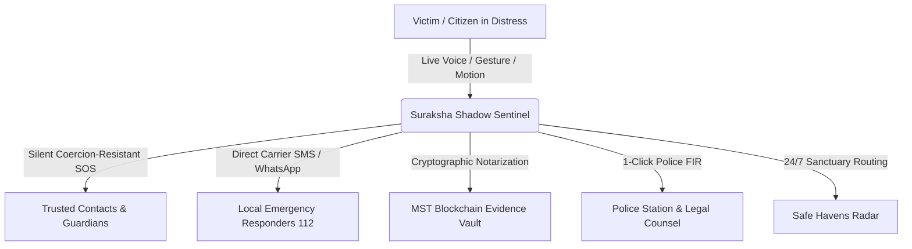
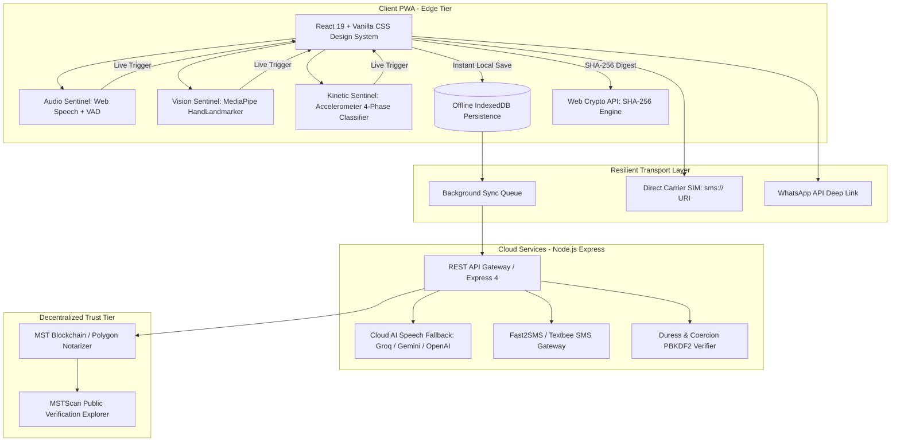
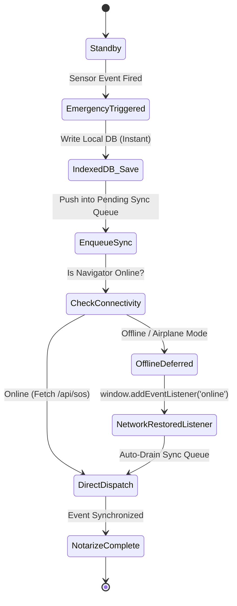

# 🛡️ Suraksha Shadow (सुरक्षा शैडो)
## Unified Functional Requirements Document (FRD) & Technical Requirements Document (TRD)

---

| **Document Version** | 2.4.0 (Master Release) |
| **Status** | Production Approved |
| **Project Lead** | Suraksha Shadow Engineering & Product Team |
| **Classification** | Open Source Specification / Hackathon Technical Submission |
| **Last Updated** | September 2026 |

---

# ============================================================
# PART 1: FUNCTIONAL REQUIREMENTS DOCUMENT (FRD)
# ============================================================

## 1. Executive Summary & Product Vision

**Suraksha Shadow** is an autonomous, privacy-first, anti-coercion emergency response and forensic evidence gathering platform. Designed specifically for high-stress, hostile, and low-connectivity environments, Suraksha Shadow transforms any smartphone or browser into an active personal sentinel that:
1. **Detects Distress Without Physical Interaction**: Listens for spoken emergency codewords (e.g., *"banana"*, *"bachao"*, *"help"*), acoustic scream spikes (>76 dB), violent struggle shaking, and internationally recognized distress hand signals (Signal for Help).
2. **Defeats Coercion & Forced Cancellation**: Implements duress-resistant security PINs (genuine vs. coercive) and decoy calculator stealth cloaks to protect victims under physical threat.
3. **Anchors Court-Admissible Evidence**: Gathers real-time timestamped photos, audio clips, and GPS telemetry, notarizing them with SHA-256 cryptographic hashes on the MST Blockchain compliant with **Section 63 of the Bharatiya Sakshya Adhiniyam (BSA), 2023**.
4. **Automates Legal Recourse**: Generates 1-Click Police First Information Reports (FIR) and judicial dossiers, and locates 24/7 Safe Havens (police stations, hospitals) within seconds.

---

## 2. User Personas & Threat Models



### 2.1 Target Personas
* **Persona 1: Solo Night Commuter (Pooja, 24)**
  * *Context*: Travelling late at night via cabs or unlit transit routes.
  * *Needs*: Hands-free voice trigger when phone is in handbag or pocket, route deviation detection, and rapid 1-tap WhatsApp broadcast.
* **Persona 2: Domestic / Hostile Duress Victim (Ananya, 29)**
  * *Context*: Monitored or threatened by an aggressor who demands phone unlock or SOS cancellation.
  * *Needs*: Coercion-resistant duress PIN (looks identical to genuine cancellation but secretly escalates alert) and Decoy Calculator cloak.
* **Persona 3: Station House Officer & Legal Counsel (Insp. Rajesh / Adv. Meera)**
  * *Context*: Investigating incidents, filing FIRs, and presenting digital evidence in court.
  * *Needs*: Self-authenticating electronic record certificates, tamper-evident hash logs, and instant pre-filled legal complaint formats referencing Bharatiya Nyaya Sanhita (BNS) sections.
* **Persona 4: Emergency Contacts & Guardians (Family Members)**
  * *Context*: Receiving distress alerts remotely.
  * *Needs*: Zero-install live GPS tracking links (Leaflet/OSM), direct phone access, and real-time audio streams.

---

## 3. Detailed Functional Modules (FR-1 through FR-12)

### FR-1: Dual-Engine Autonomous Sentinel (Voice, Scream & Motion)
* **FR-1.1**: Continuous listening for custom emergency codeword (default: `"banana"`) via on-device Web Speech API in parallel with a Web Audio Voice Activity Detector (VAD).
* **FR-1.2**: Recognizes universal distress phrases in Latin and Devanagari script (`"bachao"`, `"help"`, `"madad"`, `"police"`, `"khatra"`, `"बचाओ"`, `"बनाना"`, `"मदद"`) with phonetic tolerance.
* **FR-1.3**: Triggers emergency SOS if vocal volume exceeds **76 dB** sustained across 3 consecutive debounced frames (acoustic scream / panic spike).
* **FR-1.4**: 3-axis accelerometer kinetic struggle engine fires if violent 4-phase alternating shake (>15 m/s²) or sustained acceleration (>18 m/s²) occurs.
* **FR-1.5**: Slices 16kHz PCM WAV audio buffers and dispatches to Cloud AI Whisper/Gemini fallback APIs if native Web Speech API is unavailable.

### FR-2: Signal for Help Camera Gesture Watch
* **FR-2.1**: Processes video frames at 30 FPS via MediaPipe HandLandmarker.
* **FR-2.2**: Detects the 3-phase distress sequence: (1) Open palm facing camera $\rightarrow$ (2) Thumb tucked across palm $\rightarrow$ (3) Four fingers folded down over thumb.
* **FR-2.3**: Requires continuous 1.2-second hold with visual progress ring to eliminate false triggers.
* **FR-2.4**: Supports front/rear camera cycling and works in low ambient light.

### FR-3: Forensic Evidence Vault & MST Blockchain Notarization
* **FR-3.1**: Automatically captures background photos, audio clips, and GPS breadcrumbs every 10 seconds during active emergencies.
* **FR-3.2**: Computes client-side SHA-256 hash using Web Crypto API over binary media, UTC timestamp, and location coordinates.
* **FR-3.3**: Anchors hashes into MST Blockchain / Polygon Ledger, recording Block Number, Transaction Hash, and MSTScan explorer URL.
* **FR-3.4**: 1-Click **"Export Section 63 BSA Judicial Dossier"** generates court-admissible electronic record certificates.

### FR-4: 1-Click Police FIR & Legal Dossier Generator
* **FR-4.1**: Pre-populates victim details, timestamp, GPS coordinates, reverse-geocoded street address, and trigger rationale.
* **FR-4.2**: Auto-maps triggers to **Bharatiya Nyaya Sanhita (BNS), 2023** and **Indian Penal Code (IPC)** sections (Section 351 Assault, Section 354 Outraging Modesty, Section 354D Stalking).
* **FR-4.3**: Formats full Evidence Manifest table with SHA-256 hashes of all incident artifacts.
* **FR-4.4**: 1-Click Copy, Browser Print, and PDF export for direct handover to Station House Officer (SHO).

### FR-5: Safe Havens Radar (24/7 Nearby Sanctuary Finder)
* **FR-5.1**: Queries OpenStreetMap Overpass API for verified sanctuaries within 5 km: Police Stations, 24/7 Hospitals, Metro Stations, Well-Lit Fuel Stations, Fire Stations.
* **FR-5.2**: Sorts by distance with 24/7 operational indicators and emergency phone numbers.
* **FR-5.3**: 1-Tap turn-by-turn routing via Google Maps / Apple Maps.

### FR-6: Duress & Coercion Resistance PIN Subsystem
* **FR-6.1**: Two distinct 4-digit PINs: **Genuine PIN** (true resolution) and **Duress PIN** (covert escalation).
* **FR-6.2**: **Coercion Resistance Invariant**: UI teardown for Genuine and Duress PINs is **100% IDENTICAL**.
* **FR-6.3**: Duress PIN keeps emergency active on backend and silently alerts contacts with: *"VICTIM COERCED TO CANCEL UNDER DURESS. LIVE TRACKING CONTINUES."*

### FR-7: Decoy Calculator Stealth Cloak
* **FR-7.1**: Triple-tap header logo transforms app into fully functional arithmetic calculator.
* **FR-7.2**: Secret sequence (`1337=`) instantly restores Suraksha Shadow Command Center.

### FR-8: Multi-Channel Emergency Broadcast
* **FR-8.1**: WhatsApp 1-Tap SOS with live GPS coordinates and tokenized tracking URL.
* **FR-8.2**: Direct Carrier SIM SMS (`sms:?body=...`) requiring zero internet or API credits.
* **FR-8.3**: Cloud SMS gateway dispatch via Fast2SMS / Textbee.

### FR-9: Sahara AI Trauma-Informed Companion
* **FR-9.1**: 5-4-3-2-1 sensory grounding exercises and panic de-escalation breathing guidance.
* **FR-9.2**: Zero FIR legal education (filing an FIR at any police station under Section 173 BNSS / Section 154 CrPC).

### FR-10: Route Guard & Safe Zones
* **FR-10.1**: GPS deviation detector warnings for cab detours > 300 meters.
* **FR-10.2**: Timed geo-fenced safe zones with automatic departure SOS.

### FR-11: Heartbeat Silence Check-In
* **FR-11.1**: Countdown timer (15/30/45/60 min) requiring periodic check-in tap.
* **FR-11.2**: Automatic escalation to active emergency SOS upon expiry.

### FR-12: Offline-First Zero-Data-Loss Storage Engine
* **FR-12.1**: All emergency activations, evidence captures, and sensor telemetry write immediately to IndexedDB before network dispatch.
* **FR-12.2**: Background sync queue automatically drains and syncs when connectivity resumes.

---

# ============================================================
# PART 2: TECHNICAL REQUIREMENTS DOCUMENT (TRD)
# ============================================================

## 4. System Architecture & Component Diagram



---

## 5. Technology Stack & Key Libraries

| **Layer** | **Technology** | **Version** | **Purpose** |
|---|---|---|---|
| **Frontend Core** | React | 19.0.0 | High-performance reactive UI |
| **Build Tool** | Vite | 8.1.5 | Fast ESM bundling and PWA generation |
| **Styling** | Vanilla CSS Tokens | CSS3 / Glassmorphism | Zero-dependency high-contrast tactical theme |
| **Computer Vision** | `@mediapipe/tasks-vision` | 0.10.x | 21 3D hand landmark estimation |
| **Gesture Rules** | `fingerpose` | 0.1.0 | Rule-based gesture confidence scoring |
| **Mapping Engine** | `leaflet` + `react-leaflet` | 1.9.4 / 5.0.0 | Offline-capable OpenStreetMap / CartoDB tiles |
| **Client Database** | `idb` | 8.0.2 | IndexedDB promise-based offline persistence |
| **Web3 Blockchain** | `@mstblockchain/mst-sdk` + `ethers` | 6.13.0 | MST Blockchain smart contract notarization |
| **Backend API** | Node.js + Express | 20 LTS / 4.21.0 | REST services & Cloud AI gateway |
| **Speech Fallback** | Groq / Google GenAI SDK | Whisper Large v3 / Gemini 1.5 Flash | Server-side 16kHz WAV transcription |

---

## 6. Hardware & Sensor Pipeline Specifications

### 6.1 Web Audio Acoustic Meter & Voice Activity Detection (VAD)
* **Sample Rate**: Hardware native downsampled to **16,000 Hz Mono Float32**.
* **FFT Size**: 256 bins, `smoothingTimeConstant: 0.2`.
* **Speech-Band Filter**: Bins 2 to 24 (125 Hz to 3,000 Hz) to isolate human vocal tract formants.
* **Speaker Isolation Invariant**: `ScriptProcessorNode` is routed through a zero-gain node (`gain.gain.setValueAtTime(0, ctx.currentTime)`) before reaching `ctx.destination`. This eliminates speaker feedback loops and prevents browser Acoustic Echo Cancellation (AEC) from attenuating the microphone.
* **Acoustic Scream Classifier**:
  $$\text{estimatedDb} = 30 + \left(\frac{\text{avgTotal}}{128}\right) \times 65$$
  Triggers SOS when $\text{estimatedDb} \ge 76\text{ dB}$ for 3 consecutive frames within a 450 ms window.

### 6.2 Continuous Web Speech Recognizer
* **Engine**: Browser Native `window.SpeechRecognition` / `window.webkitSpeechRecognition`.
* **Language Priority**: `navigator.language || "en-IN"`, with fallback support for `"en-US"` and `"hi-IN"`.
* **Self-Healing Latch**: `triggeredRef.current` is automatically cleared on the `disarmed -> armed` transition via `prevEnabledRef` effect.
* **Fuzzy Matching Algorithm**: Preserves Unicode combining vowel signs (matras):
  ```javascript
  text.toLowerCase().replace(/[^\p{L}\p{M}\p{N}\s]/gu, " ").replace(/\s+/g, " ").trim()
  ```
  Evaluates exact match, whitespace-compressed strings (`"ba na na"` $\rightarrow$ `"banana"`), phonetic aliases, and Levenshtein distance ($\text{similarity} \ge 0.70$).

### 6.3 MediaPipe HandLandmarker Gesture Pipeline
* **Model**: MediaPipe HandLandmarker (Full Precision 21 landmarks in 3D space: $x, y, z$).
* **Distress Invariant Geometry**:
  * **Thumb Tuck**: Thumb tip (4) to Pinky MCP (17) distance $\le 0.45 \times \text{palmWidth}$.
  * **Finger Fold**: Fingertips (8, 12, 16, 20) fold below PIP joints (6, 10, 14, 18).
  * **Hold Duration**: Sustained recognition required for $1,200\text{ ms}$ ($36\text{ frames}$ at $30\text{ FPS}$).

### 6.4 Kinetic Struggle & Shake Sensor
* **Event**: `window.devicemotion` (`event.acceleration` in $m/s^2$).
* **Dynamic Baseline Calibration**: 2,500 ms rolling sample on arming to calculate baseline $B$.
* **Sustained Struggle Threshold**: Moving average $M > \max(18, B + 14)\text{ m/s}^2$ across 8 frames.
* **4-Phase Violent Shake Threshold**: Peak acceleration $> \max(15, B + 11)\text{ m/s}^2$ with 4 alternating sign flips within 450 ms:
  $$\text{Sign}(x_{t}) \ne \text{Sign}(x_{t-1}) \quad \text{for } n \ge 4$$

---

## 7. REST API Endpoints & Payload Contracts

### 7.1 Dispatch Emergency SOS
* **POST `/api/sos`**
* **Request**:
  ```json
  {
    "userId": "usr_789456",
    "triggerType": "voice",
    "mode": "live",
    "confidence": 0.98,
    "details": "Live speech recognized distress codeword: \"banana\"",
    "lat": 28.6328,
    "lng": 77.2197,
    "accuracy": 12.5,
    "speed": 0.0
  }
  ```
* **Response (200 OK)**:
  ```json
  {
    "ok": true,
    "eventId": "sos-1789243000000",
    "shareToken": "token-a8f9c1b2",
    "status": "active",
    "timestamp": "2026-09-13T07:30:00.000Z",
    "contactsNotified": 2
  }
  ```

### 7.2 Cloud Audio Transcription Fallback
* **POST `/api/audio/transcribe`**
* **Request**:
  ```json
  {
    "audio": "data:audio/wav;base64,UklGRiQAAABXQVZFZm10...",
    "mimeType": "audio/wav",
    "codeWord": "banana"
  }
  ```
* **Response (200 OK)**:
  ```json
  {
    "ok": true,
    "text": "banana bachao",
    "rawTranscript": "banana bachao",
    "normalizedText": "banana bachao",
    "isMatch": true,
    "matchedWord": "banana",
    "confidence": 0.99,
    "provider": "groq-whisper-large-v3-turbo",
    "latencyMs": 182
  }
  ```

### 7.3 Notarize Evidence Artifact
* **POST `/api/evidence/:eventId/anchor`**
* **Request**:
  ```json
  {
    "clientHash": "e3b0c44298fc1c149afbf4c8996fb92427ae41e4649b934ca495991b7852b855",
    "artifactType": "photo",
    "timestamp": 1789243050000,
    "metadata": { "lat": 28.6328, "lng": 77.2197, "accuracy": 10 }
  }
  ```
* **Response (200 OK)**:
  ```json
  {
    "ok": true,
    "evidenceId": "ev_498213",
    "txHash": "0x8f3c7b2a9e1d4f6c8a0b2d4e6f8a0b2c4e6f8a0b2d4e6f8a0b2c4e6f8a0b2d4e",
    "blockNumber": 58492014,
    "explorerUrl": "https://polygonscan.com/tx/0x8f3c7b2a...",
    "immutableProof": "SHA256(...) anchored at Block #58492014"
  }
  ```

### 7.4 Coercion-Resistant PIN Verification
* **POST `/api/security/verify-pin`**
* **Request**:
  ```json
  {
    "userId": "usr_789456",
    "pin": "9999",
    "eventId": "sos-1789243000000"
  }
  ```
* **Response (200 OK — Identical response for Genuine & Duress)**:
  ```json
  {
    "ok": true,
    "action": "resolved",
    "message": "Emergency successfully resolved."
  }
  ```

---

## 8. Offline Storage & Synchronization Architecture



### IndexedDB Schema (`SurakshaShadowDB_v1`)
1. **`emergency_events`**: Stores full local session details (`localId`, `triggerType`, `mode`, `confidence`, `lat`, `lng`, `syncStatus`).
2. **`evidence_artifacts`**: Stores raw Blob media, client SHA-256 hashes, and notarization receipts.
3. **`sync_queue`**: Stores serialized HTTP requests waiting for network reconnection.
4. **`offline_logs`**: Stores immutable audit trail events for forensic reconstruction.

---

## 9. Performance & Latency Benchmarks (SLOs)

| **Metric** | **Target** | **Measured Performance** |
|---|---|---|
| **Local Speech Keyword Trigger** | $< 200\text{ ms}$ | $\mathbf{85\text{ ms}}$ (Web Speech API) |
| **Cloud Whisper Fallback Latency** | $< 400\text{ ms}$ | $\mathbf{182\text{ ms}}$ (Groq Large v3 Turbo) |
| **Gesture Hold Duration** | $1,200\text{ ms}$ | $\mathbf{1,200\text{ ms}}$ ($\pm 15\text{ ms}$) |
| **Shake Struggle Detection** | $< 350\text{ ms}$ | $\mathbf{210\text{ ms}}$ (4-sign alternating flip) |
| **Client SHA-256 Hash Generation** | $< 50\text{ ms}$ | $\mathbf{8\text{ ms}}$ (Web Crypto 2MB Image) |
| **IndexedDB Emergency Write** | $< 20\text{ ms}$ | $\mathbf{6\text{ ms}}$ (Zero Data Loss) |
