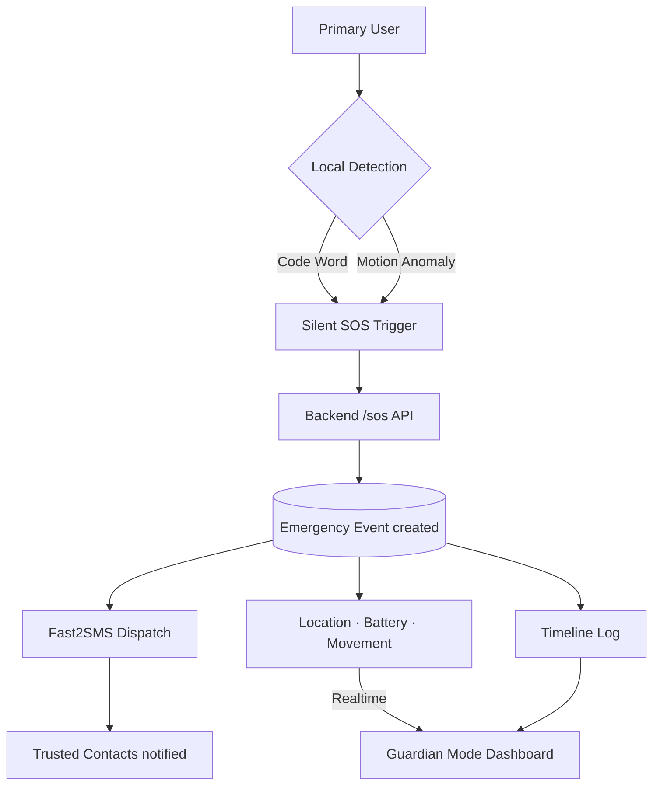
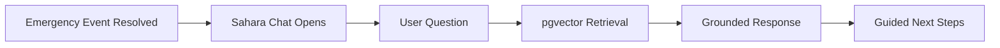
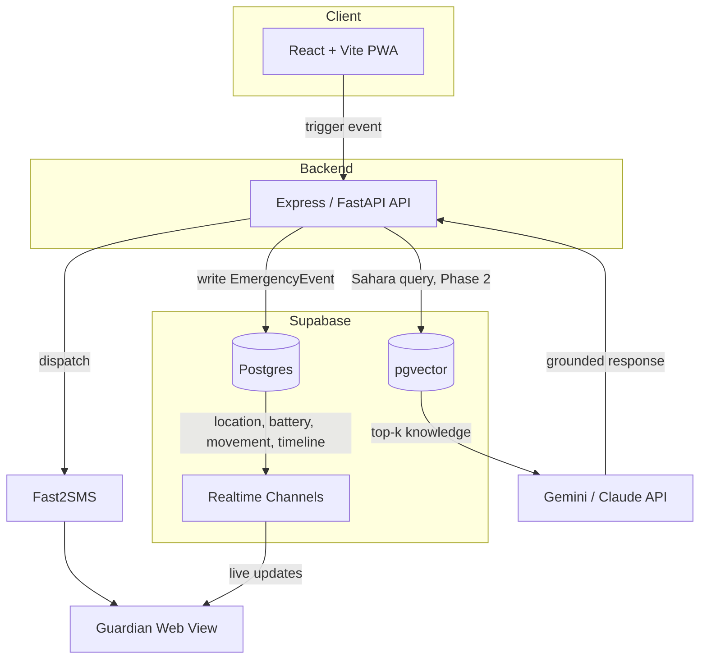
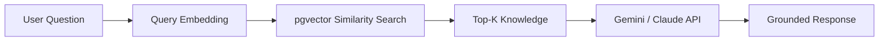
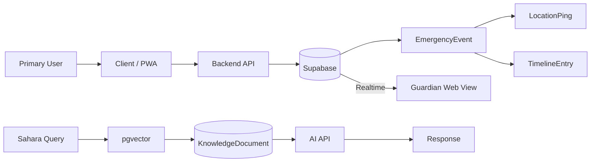
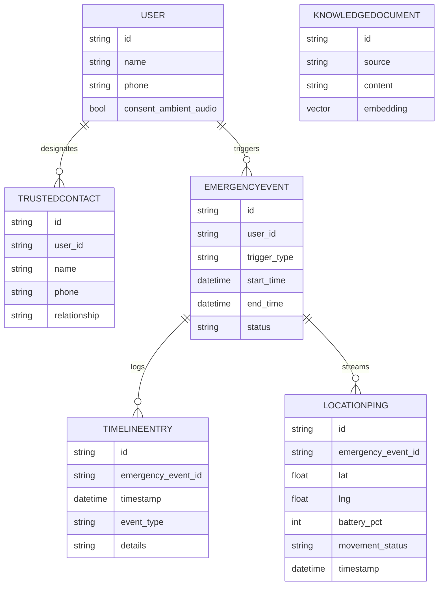

<div align="center">


# 🛡️ SURAKSHA SHADOW


An AI-powered personal safety companion that silently detects distress, dispatches help without tipping off a threat, keeps trusted contacts informed in real time, and offers structured support after an incident.

<br/>


`🔴 Emergency Safety Platform`  ·  `🟢 Hackathon Project`  ·  `🤖 AI-Powered`  ·  `🔐 Privacy & Consent First`


</div>

---

## 🚨 The Problem

In a dangerous situation, the things you'd normally do to get help — pulling out your phone, opening an app, dialing a number, speaking out loud — are exactly the things that can escalate the danger. Visible help-seeking behavior can tip off a threat before help ever arrives.

## 🛡️ The Solution

**Suraksha Shadow** flips that model. Instead of asking the Primary User to visibly *ask* for help, it watches for signals that help is already needed — a spoken code word or a sudden motion anomaly — and acts on them silently. No visible alert, no obvious app switch, no dial screen. The system contacts trusted people on the user's behalf, keeps them informed in real time through **Guardian Mode**, and — once the emergency has passed — walks the user through what to do next with **Sahara**.

---

## 🧩 The Three-Pillar Architecture

<table>
<tr>
<td width="33%" valign="top">

### 🛡️ Shield
**Phase 1 · Live**

Silent, real-time protection. Detects distress locally (code word or motion anomaly) and fires a silent SOS to Trusted Contacts — no on-screen alert, no visible trigger.

</td>
<td width="33%" valign="top">

### 👁️ Guardian Mode
**Phase 1 · Live**

The Trusted Contact's side of the story. A live dashboard showing location, battery, movement status, and a timestamped emergency **Timeline** — once Shield fires.

</td>
<td width="33%" valign="top">

### 🌿 Sahara
**Phase 2 · Roadmap**

A trauma-informed AI chat that opens after an incident, grounded in a curated legal/support **Knowledge Base**, guiding the user through complaints, evidence, and nearby help.

</td>
</tr>
</table>

> Shield and Guardian Mode are the hackathon's Phase 1 build. Sahara is designed and specified but scoped as Phase 2 — see [Project Scope](#-current-scope-vs-roadmap).

---

## 🔄 How It Works



Once an emergency resolves, the Primary User is handed off to the Sahara pathway (Phase 2):



---

## ⚡ Emergency Flow

| Step | Action | Detail |
|---|---|---|
| **01 — Detect** 🎙️ | Code word or motion anomaly | Runs locally, no server round-trip needed for detection itself |
| **02 — Trigger** 🔕 | Silent SOS | No visible on-screen alert to the Primary User |
| **03 — Dispatch** 📡 | Backend → Fast2SMS → Trusted Contacts | Target: within ~3 seconds |
| **04 — Track** 📍 | Live location, battery %, movement status | Streamed at a fixed interval during the emergency |
| **05 — Respond** 👁️ | Guardian Mode | Trusted Contact opens a live web dashboard + Timeline |
| **06 — Recover** 🌿 | Sahara *(Phase 2)* | Trauma-informed guidance on complaints, evidence, help desks |

---

## 🧭 Feature Matrix

#### 🕵️ Stealth Protection
- Silent trigger detection (no visible action required)
- Spoken code-word detection during a real or simulated call
- Motion-anomaly detection (e.g. running, struggling)
- Discreet SOS — no on-screen alert on trigger

#### 🎭 Deception / Escape
- AI-generated fake-call dialogue, converted to speech, to make it appear the Primary User is on an ordinary call

#### 📡 Emergency Dispatch & Guardian Mode
- SMS alerts to Trusted Contacts via Fast2SMS (target: ~3s)
- Continuous live location sharing until resolution
- Battery status reporting
- Movement status detection (stationary vs. in motion, and nature of motion)
- Timestamped Emergency Timeline (trigger fired, location updates, contact acknowledgment)

#### 🔐 Privacy & Consent
- Ambient audio is opt-in only, never on by default
- Consent can be granted or revoked at any time, independent of an active emergency
- Server-side consent enforcement — the stream is rejected if consent isn't set
- Supabase Row-Level Security scoping each user's data to themselves and their Trusted Contacts
- Limited retention: emergency data is deleted after the emergency plus a short grace period
- TLS on all data in transit

#### 🤖 AI *(Sahara components are Phase 2)*
- AI-generated natural-sounding fake-call dialogue (Phase 1)
- Retrieval-grounded Sahara responses over a curated knowledge base (Phase 2)
- pgvector similarity search over BNS sections, the POSH Act, and verified NGO/helpline directories (Phase 2)

---

## 🏗️ System Architecture



**Flow, in words:** the client detects a trigger locally → calls the backend API → the backend writes an `EmergencyEvent` to Supabase and dispatches SOS via Fast2SMS → Supabase Realtime pushes live updates to the Trusted Contact's Guardian web view → Sahara (Phase 2), once active, queries Supabase pgvector for relevant knowledge before calling the AI API.

---

## 🛠️ Technology Stack

| Layer | Choice | Why |
|---|---|---|
| **Frontend** | React + Vite (PWA) | Fast to build, installable as a Progressive Web App, no app-store dependency |
| **Backend** | Express / FastAPI | Lightweight, quick to stand up on a hackathon timeline |
| **Database** | Supabase (Postgres) | Managed Postgres with built-in auth, storage, and Realtime |
| **Vector Search** | Supabase pgvector | Keeps Sahara's knowledge base in the same database — no separate vector service |
| **Realtime Sync** | Supabase Realtime | Powers Guardian Mode's live dashboard without a custom WebSocket server |
| **AI Reasoning** | Gemini / Claude API | Handles both fake-call dialogue and Sahara's grounded responses |
| **Silent Detection** | Web Speech API + Device Motion API | Free, browser-native, no extra SDKs needed |
| **Alerts** | Textbee.dev / Twilio / Fast2SMS | Open-source Android SMS gateway (Textbee) & cloud providers |
| **Deployment** | Vercel (frontend & serverless) / Render (backend) | Fast, free-tier friendly, zero infrastructure friction |

---

## 🤖 AI Behind Suraksha Shadow

Two distinct AI use cases:

### 1. Fake-Call Dialogue Generation
On trigger, a streaming call to the Gemini/Claude API generates natural-sounding simulated conversation, converted to speech via a text-to-speech service — so it appears the Primary User is engaged in an ordinary phone call.

### 2. Sahara — Retrieval-Grounded Guidance *(Phase 2)*

Sahara is deliberately **not** a free-form chatbot. Legal and procedural guidance is high-stakes, so answers are constrained to a curated knowledge base rather than open generation:



The knowledge base is designed to hold verified, India-specific sources — relevant **BNS** sections, the **POSH Act**, and verified NGO/helpline directories — manually curated and verified before ingestion, not scraped automatically. Constraining generation to retrieved context is what keeps Sahara's answers grounded on legal/procedural questions instead of guessing.

---

## 🔐 Privacy by Design

| Principle | How it's enforced |
|---|---|
| **Opt-in ambient audio** | Never enabled by default; the Primary User must explicitly grant consent |
| **Revocable consent** | Consent can be granted or revoked at any time, independent of an active emergency |
| **Server-side enforcement** | The backend gates the ambient-audio stream on the `consent_ambient_audio` flag and rejects it if consent isn't set |
| **Row-Level Security** | Supabase RLS restricts each user's data to themselves and their designated Trusted Contacts |
| **Limited retention** | Location and audio data are retained only for the emergency's duration plus a short grace period, then deleted |
| **Encrypted in transit** | All data in transit uses TLS |
| **Local-first detection** | Code-word and motion-anomaly detection run locally, without a server round-trip for the detection step itself |

Suraksha Shadow is built to minimize data exposure — it does not claim to be unhackable or unconditionally secure.

---

## 🔀 Data Flow



---

## 🗄️ Data Model



---

## 🛡️ Security Architecture

- **TLS** on all data in transit
- **Supabase Row-Level Security** restricting each user's data to themselves and their designated Trusted Contacts
- **Consent gating** on `consent_ambient_audio`, enforced server-side — the ambient-audio stream is rejected if consent isn't set
- **Scoped Realtime channels** — Guardian Mode subscribes to a channel scoped to a specific `EmergencyEvent`
- **Controlled knowledge retrieval** — Sahara's answers are constrained to retrieved `KnowledgeDocument` context, not unconstrained generation
- **Retry + fallback on dispatch** — SOS dispatch retries on failure (e.g. SMS gateway timeout); the client falls back to cached last-known location if a live GPS fix isn't available
- **Limited data retention** — emergency data is deleted after the emergency plus a short grace period

---

## ⚡ Performance Target

> **SOS trigger → SMS dispatch: within ~3 seconds**, under normal network conditions.

This is a design **target** drawn from the technical requirements, not a measured benchmark. Location, battery, and movement updates are targeted to stream to Guardian Mode at a fixed interval of roughly every 5–10 seconds during an active emergency.

---

## 🧭 User Journeys

**👩 Primary User**
`Setup` → `Configure Trusted Contact` → `Activate Shield` → `Silent Detection` → `Silent SOS` → `Guardian Assistance` → `Sahara Support (Phase 2)`

**👨‍👩‍👧 Trusted Contact (Guardian)**
`Receive SMS Alert` → `Open Guardian Web View` → `Observe Live Location & Status` → `Follow Timeline` → `Respond`

---

## 🎯 Current Scope vs Roadmap

#### Phase 1 — Hackathon Scope
- Shield: silent trigger detection (code word + motion anomaly), silent SOS dispatch, fake-call deception
- Guardian Mode: live location sharing, consent-gated ambient audio, battery + movement status, Emergency Timeline

#### Phase 2 — Roadmap
- Sahara: trauma-informed AI chat, guided next-steps flow (complaint filing, evidence documentation, help-desk location), knowledge-base-grounded answers over BNS/POSH/NGO sources

#### Out of Scope (all phases)
- Direct integration with police / emergency-dispatch systems
- Hardware or wearable devices
- Automated law-enforcement reporting
- Multi-language support beyond English/Hindi
- Full offline operation

---

## 📁 Project Structure

> ⚠️ Example/template structure — not confirmed against the actual repository. Replace with the real layout if it differs.

```
suraksha-shadow/
├── frontend/                 # React + Vite PWA
│   ├── src/
│   │   ├── shield/           # Detection + silent SOS trigger logic
│   │   ├── guardian/         # Guardian Mode dashboard views
│   │   ├── sahara/           # Phase 2 — Sahara chat UI
│   │   └── shared/
│   └── vite.config.js
├── backend/                  # Express / FastAPI service
│   ├── routes/
│   │   └── sos.js            # /sos endpoint
│   ├── services/
│   │   ├── fast2sms.js
│   │   └── rag.js             # Phase 2 — Sahara RAG pipeline
│   └── db/                   # Supabase client + queries
├── supabase/
│   └── migrations/           # Postgres schema, RLS policies
└── README.md
```

---

## 🚀 Getting Started

### Prerequisites
- Node.js (LTS)
- A Supabase project (Postgres + pgvector enabled)
- A Fast2SMS account/API key
- A Gemini or Claude API key

### Installation
```bash
git clone https://github.com/asmodeus276/Suruksha-Shadow.git
cd suraksha-shadow

# Frontend
cd frontend && npm install

# Backend
cd ../backend && npm install
```

### Environment Variables

| Variable | Purpose |
|---|---|
| `SUPABASE_URL` | Supabase project URL |
| `SUPABASE_SERVICE_ROLE_KEY` | Supabase service role key (backend only) |
| `VITE_SUPABASE_URL` | Supabase project URL (client) |
| `VITE_SUPABASE_ANON_KEY` | Supabase anon/public key (client) |
| `TEXTBEE_API_KEY` | *(Recommended)* Textbee API key from [textbee.dev](https://textbee.dev) |
| `TEXTBEE_DEVICE_ID` | *(Optional)* Textbee device ID |
| `SMS_PROVIDER` | Preferred SMS provider (`textbee`, `twilio`, `fast2sms`, `demo`) |
| `GEMINI_API_KEY` | Google Gemini API key for Sahara & fake-call dialogue |
| `FAST2SMS_API_KEY` | Fast2SMS API key (alternative domestic Indian gateway) |
| `SMS_DEMO_MODE` | `false` to send real SMS; `true` for simulated console logs |

*(Placeholders — replace with actual secrets in your local `.env`. Never commit real keys.)*

### Running Frontend
```bash
cd frontend
npm run dev
```

### Running Backend
```bash
cd backend
npm run dev
```

### Database / Supabase Setup
1. Create a Supabase project and enable the `pgvector` extension.
2. Apply the schema migrations under `supabase/migrations/`.
3. Configure Row-Level Security policies so each user can only access their own data and their designated Trusted Contacts' data.

### Deployment
- **Frontend** → Netlify
- **Backend** → Render

---

## 🎬 Demo

<!-- Add demo video here -->
<!-- Add live demo link here -->
<!-- Add presentation deck here -->

## 📱 Interface Preview

| Shield | Calculator Decoy | Emergency Dashboard |
|---|---|---|
| *screenshot placeholder* | *screenshot placeholder* | *screenshot placeholder* |

| Guardian Mode | Sahara *(Phase 2)* | Safety Hub |
|---|---|---|
| *screenshot placeholder* | *screenshot placeholder* | *screenshot placeholder* |

---

## 🌍 Why It Matters

Suraksha Shadow is built around a few concrete goals: giving people discreet access to help without a visible "ask," reducing the risk that visibly seeking help escalates a threatening situation, giving Trusted Contacts more than a location pin so they can judge severity and respond appropriately, and — eventually, through Sahara — reducing the information gap survivors face when figuring out complaint procedures and evidence steps on their own.

## 🧠 Designed Around One Principle

> "Help should be accessible without making the situation more dangerous."

Every design choice traces back to this: stealth so seeking help doesn't announce it, consent so trust isn't assumed, realtime awareness so Trusted Contacts can act on more than a dot on a map, and post-incident guidance so the moment after an emergency isn't a dead end.

---

## ⚠️ Known Limitations

- Requires an active internet connection — no offline mode in Phase 1
- Web Speech API browser support varies (best on Chrome-based browsers) — a known constraint for the hackathon demo
- Requires microphone, location, and motion-sensor permissions to function
- Supported languages limited to English/Hindi
- No direct integration with police or emergency-dispatch systems
- At least one Trusted Contact must be configured before Shield or Guardian Mode can function
- Sahara's guidance (Phase 2) is India-specific (BNS, POSH Act) for this version

---

## 🗺️ Future Roadmap

`Phase 1 — Shield + Guardian Mode` → `Phase 2 — Sahara (guided chat + knowledge base)` → *Potential Future Directions*

Potential Future Directions are speculative ideas, not committed features — e.g. broader language support or additional knowledge-base sources would fall here, subject to future scoping.

---

<div align="center">

</div>

## 👥 Team Apex Innovators

- Member 1 — Role
- Member 2 — Role
- Member 3 — Role
- Member 4 — Role

*(GitHub / LinkedIn links here)*

---

## 🙏 Acknowledgements

Built with React, Vite, Supabase (Postgres, pgvector, Realtime), the Gemini/Claude API, Fast2SMS, and deployed via Netlify and Render.

---

## ⚖️ Responsible AI & Safety Disclaimer

Suraksha Shadow is a safety-*support* technology, not a replacement for emergency services or professional legal advice. AI-generated content — including Sahara's guidance — should be treated as a starting point, not a substitute for consulting the police, a lawyer, or a qualified professional. Availability depends on device permissions, browser support, network connectivity, and third-party service uptime (Supabase, Fast2SMS, the AI provider). Legal and procedural information should always be verified against authoritative, up-to-date sources.

---

<div align="center">


Built by **Team Apex Innovators** for **CodeBuild 1.0**


</div>
