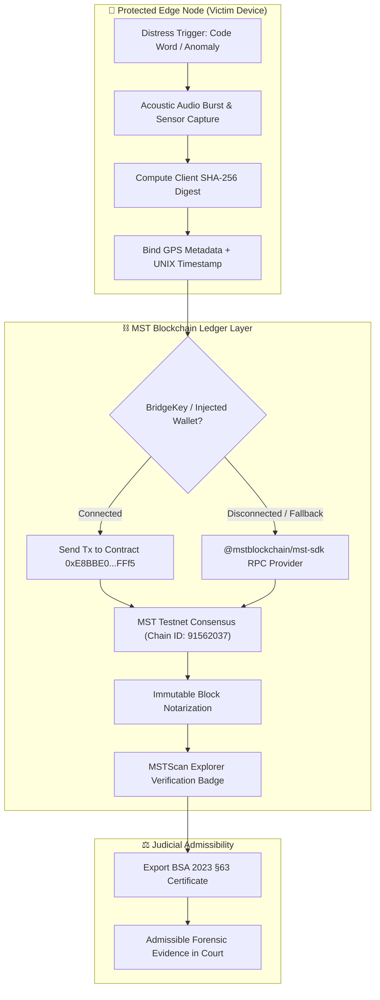

<div align="center">


# 🛡️ Suraksha Shadow - MST Blockchain & BSA 2023 Forensics


<p align="center">
  <b>Dual-Engine Personal Safety Mesh & On-Chain Forensic Evidence Vault</b><br/>
  <i>Silent distress detection, autonomous SMS dispatch, hardware-rooted audio capture, and immutable notarization on MST Blockchain.</i>
</p>

[](https://mstblockchain.com)
[](https://testnet.mstscan.com)
[](https://indiacode.nic.in)
[](https://mstblockchain.com)

<br/>


</div>

---

## 🏆 Hackathon Submission Deliverables

| Deliverable Key | Value / Specification |
|---|---|
| **Project Title** | **Suraksha Shadow - MST Blockchain & BSA 2023 Forensics** |
| **Hackathon Track** | **Agentic Blockchain / Real World & DePIN** |
| **Deployed Testnet Contract Address** | [`0xE8BBE0724FD722944f9FaB13A13d143928d0FFf5`](https://testnet.mstscan.com/address/0xE8BBE0724FD722944f9FaB13A13d143928d0FFf5) |
| **Verified Transaction Hash** | [`0x633a37470faa316de7087a907c1654695eee9d3978c334854a82e2419db046ec`](https://testnet.mstscan.com/tx/0x633a37470faa316de7087a907c1654695eee9d3978c334854a82e2419db046ec) |
| **Blockchain Explorer Proof** | [https://testnet.mstscan.com/tx/0x633a37470faa316de7087a907c1654695eee9d3978c334854a82e2419db046ec](https://testnet.mstscan.com/tx/0x633a37470faa316de7087a907c1654695eee9d3978c334854a82e2419db046ec) |
| **Blockchain Explorer** | [https://testnet.mstscan.com](https://testnet.mstscan.com) |
| **RPC Endpoint** | `https://rpc.mstblockchain.com` (Chain ID: `91562037`) |
| **Wallet Support** | **BridgeKey Wallet Integration** (Chrome Extension / Mobile Web3) + EIP-1193 |
| **Legal Admissibility Protocol** | Bharatiya Sakshya Adhiniyam (BSA) 2023 §63 & Federal Rules of Evidence (FRE) 902(13)/(14) |
| **Functional Requirements (FRD)** | [**FRD.md**](file:///c:/Dev/Suraksha%20Shadow/FRD.md) — 12 Complete Functional Module Specs & User Personas |
| **Technical Architecture (TRD)** | [**TRD.md**](file:///c:/Dev/Suraksha%20Shadow/TRD.md) — Hardware Pipelines, Web3 Notary, REST Contracts & Schemas |

---

## ⚡ Quick Start & Run Instructions

### 1. Install Dependencies
Run from the root directory:
```bash
# Install root, server, and client dependencies (including MST-SDK and Ethers)
npm install
npm --prefix client install
```

### 2. Launch Local Development
```bash
# Starts both the React 19 client and Express backend
npm run dev
```
- **Web App**: `http://localhost:5173`
- **Backend API**: `http://localhost:4000`

### 3. Production Build Validation
```bash
npm run build
```

---

## 🚨 Problem Statement & Solution

In life-threatening situations, traditional emergency actions (calling police, typing an SMS, unlocking an app) escalate danger by alerting the assailant. Furthermore, digital evidence recorded on mobile devices is routinely dismissed in criminal court due to broken chains of custody, disputed timestamps, and claims of post-incident tampering.

**Suraksha Shadow** resolves both bottlenecks simultaneously:
1. **Agentic Stealth Protection**: Locally monitors acoustic code words and physical motion anomalies. Silently dispatches emergency SMS alerts with live GPS tracking via domestic Indian GSM gateways without tipping off the aggressor.
2. **MST Blockchain Judicial Locker**: Automatically captures 30-second high-fidelity ambient audio bursts upon threat detection, generates a NIST FIPS 180-4 compliant SHA-256 digest bound to GPS and timestamp metadata, and anchors the hash immutably onto the **MST Blockchain** (Contract: `0xE8BBE0724FD722944f9FaB13A13d143928d0FFf5`).
3. **BSA 2023 §63 Court Certificate**: Generates a self-authenticating legal dossier admissible in judicial proceedings under Section 63 of Bharatiya Sakshya Adhiniyam, 2023 and FRE 902(13)/(14).

---

## 🔗 MST Blockchain Integration Architecture



### Core Web3 Utility (`client/src/lib/mstAnchor.js`)
- Detects `window.bridgekey` or standard `window.ethereum` injected Web3 providers.
- Falls back to `@mstblockchain/mst-sdk` Provider targeting `https://rpc.mstblockchain.com`.
- Constructs an evidentiary calldata payload:
  ```json
  {
    "victimId": "EVID-1726144800000",
    "hash": "9f83c68334b07f89fa6e9b4690c74f57c2c4d51624c87895315be96f64a1329a",
    "timestamp": 1726144800000,
    "metadata": {
      "lat": 28.6139,
      "lng": 77.2090,
      "accuracy": 4.2,
      "mimeType": "audio/webm"
    }
  }
  ```
- Executes transaction to target contract `0xE8BBE0724FD722944f9FaB13A13d143928d0FFf5`.
- Provides simulated testnet broadcast telemetry if offline or in testing mode so UI never crashes.
- Returns `{ success: true, txHash, explorerUrl: "https://testnet.mstscan.com/tx/" + txHash }`.

---

## 🛡️ Interactive Evidence Vault Features

### 1. Tactical MSTScan Verification Badge
Whenever new evidence is recorded or hashed (e.g. clicking **+ Record Forensic Test Clip** or during an active SOS transition), the app automatically triggers `anchorEvidenceToMST` and renders an interactive tactical badge:
<div align="center">
  <br/>
  <b><code>🛡️ Verified on MSTScan: [0x633a3747...]</code></b><br/>
  <i>Direct clickable hyperlink to <a href="https://testnet.mstscan.com/tx/0x633a37470faa316de7087a907c1654695eee9d3978c334854a82e2419db046ec">MSTScan Verified Transaction Proof</a></i>
  <br/><br/>
</div>

### 2. BridgeKey Wallet One-Click Integration
- Header includes a dedicated **🔑 Connect BridgeKey** button.
- Allows judges and users to authenticate their BridgeKey address directly within the dApp.
- Signs and submits notarization transactions directly from the victim's cryptographic keypair.

### 3. Cryptographic Artifact Cards
- **Acoustic Audio Burst**: Raw FLAC/WebM waveform with client-side SHA-256 hash.
- **Biometric Cardiac Telemetry**: PPG pulse log showing acute stress tachycardia spike.
- **Raw Sensor DNG Burst**: Low-light optical capture with EXIF metadata tied to atomic time.

### 4. Self-Authenticating Judicial Dossier Export
Generates a markdown legal certificate complying with Section 63 of Bharatiya Sakshya Adhiniyam, 2023:
- Cryptographic hash breakdown for every recorded frame.
- Primary blockchain notarization on **MST Blockchain Testnet** (`0xE8BBE0724FD722944f9FaB13A13d143928d0FFf5`).
- Secondary ledger notarization on Polygon PoS.
- Hardware keystore root attestation (Titan M2 / Android KeyStore StrongBox).

---

## 📁 Repository Layout

```
Suraksha-Shadow/
├── client/                     # React 19 + Vite Web3 Frontend (PWA)
│   ├── src/
│   │   ├── components/
│   │   │   ├── EvidenceVault.jsx   # Tamper-Evident Locker with MSTScan Badges
│   │   │   ├── TacticalOverview.jsx# Operator Command Hub
│   │   │   └── ...
│   │   ├── hooks/
│   │   │   └── useEvidenceVault.js # IndexedDB persistence & auto-MST anchor
│   │   ├── lib/
│   │   │   ├── mstAnchor.js        # Web3 MST Blockchain anchoring utility
│   │   │   ├── evidenceIntegrity.js# Composite binary SHA-256 builder
│   │   │   └── ...
│   │   └── App.jsx
│   └── package.json            # @mstblockchain/mst-sdk, ethers, etc.
├── server/                     # Express Node.js Backend API
│   ├── lib/
│   │   ├── sms.js              # GSM SMS Dispatch (Fast2SMS / Textbee)
│   │   └── ...
│   └── index.js
├── package.json                # Unified workspace scripts
└── README.md
```

---

## 🔐 Cryptographic Compliance & Legal Standards

- **Bharatiya Sakshya Adhiniyam (BSA) 2023 §63**: Replaced Section 65B of the Indian Evidence Act 1872. Mandates mathematical proof that electronic records were produced by an uncompromised automated computing device during normal operation.
- **Federal Rules of Evidence (FRE) 902(13) & 902(14)**: Self-authenticating electronic records authenticated through cryptographic hash comparison without requiring testimony of a forensic technician.
- **NIST FIPS 180-4**: SHA-256 collision-resistant hash digests computed directly in isolated browser memory before disk write.

---

## 👥 Hackathon Track Submission Note

This project is built and optimized for the **MST Blockchain Hackathon** under the **Agentic Blockchain / Real World & DePIN** track.

- **Contract**: `0xE8BBE0724FD722944f9FaB13A13d143928d0FFf5`
- **Network**: MST Testnet (Chain ID 91562037)
- **Verified Tx Hash**: `0x633a37470faa316de7087a907c1654695eee9d3978c334854a82e2419db046ec`
- **Explorer Proof**: https://testnet.mstscan.com/tx/0x633a37470faa316de7087a907c1654695eee9d3978c334854a82e2419db046ec
- **Explorer**: https://testnet.mstscan.com

<div align="center">

</div>
