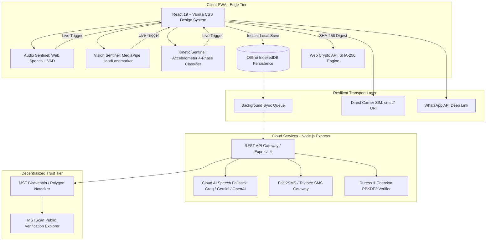
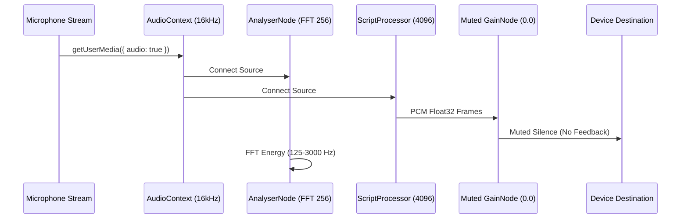
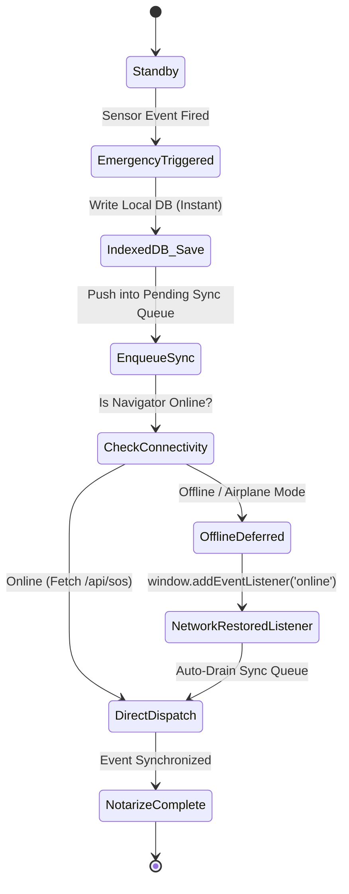

# ⚙️ Technical Requirements Document (TRD)
## 🛡️ Suraksha Shadow (सुरक्षा शैडो)
### System Architecture, Hardware Pipelines & Cryptographic Specifications

---

| **Document Version** | 2.4.0 |
| **Status** | Approved / Production Architecture |
| **Primary Frameworks** | React 19, Vite, Node.js Express, MediaPipe, Web Audio/Speech, Web3 MST SDK |
| **Classification** | Engineering Architecture Reference |
| **Last Updated** | September 2026 |

---

## 1. System Architecture & Topology

Suraksha Shadow utilizes a hybrid **Edge-Autonomous PWA & Serverless Node.js Architecture**. Core emergency detection, biometric evaluation, kinetic classification, and cryptographic hashing run **100% locally on-device** within browser workers to guarantee zero-latency execution even under severe network degradation.



---

## 2. Technology Stack & Dependencies

### 2.1 Client Frontend (Edge PWA)
* **Framework**: React 19.0.0 + Vite 8.1.5 (ESM architecture).
* **Styling**: Tailored Dark-Mode Glassmorphism Design System (`index.css`) with curated HSL color tokens (`--ember`, `--alarm`, `--surface-low`, `--paper`).
* **Computer Vision**: `@mediapipe/tasks-vision` (HandLandmarker 21 3D landmarks) + `fingerpose` gesture estimator.
* **Geospatial Mapping**: `leaflet` 1.9.4 + `react-leaflet` 5.0.0 with OpenStreetMap and CartoDB Dark Matter tile providers.
* **Storage & Offline Sync**: `idb` 8.0.2 (IndexedDB promise wrapper) with automatic network retry sync queue.
* **Cryptographic Hashing**: Native `window.crypto.subtle.digest("SHA-256", buffer)`.
* **Icons**: `lucide-react` 1.16.0.

### 2.2 Decentralized Blockchain Tier
* **Blockchain SDK**: `@mstblockchain/mst-sdk` + `ethers.js` 6.13.0.
* **Anchoring Smart Contract**: MST Blockchain Evidentiary Notary Contract (Polygon Proof-of-Stake / MST Layer-1).

### 2.3 Backend API (Node.js & Express)
* **Runtime**: Node.js v18.0.0+ / v20 LTS.
* **Web Framework**: Express 4.21.0 (with CORS, body-parser for 50MB audio base64 buffers).
* **Cloud AI Speech Transcribers**:
  * Primary: Groq SDK (`groq-sdk` / `whisper-large-v3-turbo` ~150ms latency).
  * Secondary: Google Generative AI SDK (`@google/genai` / `gemini-1.5-flash-audio`).
  * Tertiary: OpenAI API (`openai` / `whisper-1`).
* **SMS Dispatch**: Axios integration with Fast2SMS & Textbee HTTP APIs.

---

## 3. Hardware & Sensor Pipeline Specifications

---

### 3.1 Web Audio Acoustic Meter & Voice Activity Detection (VAD)
* **File**: `client/src/hooks/useShieldDetection.js`
* **Sample Rate**: Hardware native downsampled to **16,000 Hz Mono Float32**.
* **FFT Size**: 256 bins, `smoothingTimeConstant: 0.2`.
* **Speech-Band Filter**: Bins 2 to 24 (125 Hz to 3,000 Hz) to isolate human vocal tract formants.
* **Speaker Isolation Invariant**: `ScriptProcessorNode` / `AudioWorkletNode` is routed through a zero-gain node (`gain.gain.setValueAtTime(0, ctx.currentTime)`) before reaching `ctx.destination`. This eliminates speaker feedback loops and prevents browser Acoustic Echo Cancellation (AEC) from attenuating the microphone.
* **Acoustic Scream Classifier**:
  $$\text{estimatedDb} = 30 + \left(\frac{\text{avgTotal}}{128}\right) \times 65$$
  * Triggers SOS when $\text{estimatedDb} \ge 76\text{ dB}$ for 3 consecutive frames within a 450 ms window.



---

### 3.2 Continuous Multi-Dialect Web Speech Recognizer
* **Engine**: Browser Native `window.SpeechRecognition` / `window.webkitSpeechRecognition`.
* **Language Priority**: `navigator.language || "en-IN"`, with fallback support for `"en-US"` and `"hi-IN"`.
* **Lifecycle & Self-Healing Latch**:
  * `triggeredRef.current` is automatically cleared on the `disarmed -> armed` transition via `prevEnabledRef` effect.
  * Treats `onerror: "no-speech"` as normal silence timeout rather than fatal failure.
  * Re-arms automatically with a 150 ms debounce on `onend`.
* **Fuzzy Matching Algorithm**:
  * Normalization: Strips non-letters while preserving Unicode combining vowel signs (matras):
    ```javascript
    text.toLowerCase().replace(/[^\p{L}\p{M}\p{N}\s]/gu, " ").replace(/\s+/g, " ").trim()
    ```
  * Evaluates exact match, whitespace-compressed strings (`"ba na na"` $\rightarrow$ `"banana"`), phonetic alias dictionary, universal emergency list, and Levenshtein distance:
    $$\text{Similarity}(s_1, s_2) = 1 - \frac{\text{Levenshtein}(s_1, s_2)}{\max(|s_1|, |s_2|)} \ge 0.70$$

---

### 3.3 MediaPipe HandLandmarker Gesture Pipeline
* **File**: `client/src/hooks/useGestureDetection.js`
* **Model**: MediaPipe HandLandmarker (`hand_landmarker.task`, Full Precision 21 landmarks in 3D Euclidean space: $x, y, z$).
* **Distress Invariant Geometry**:
  * **Thumb Tuck**: Thumb tip (landmark 4) Euclidean distance to Pinky MCP (landmark 17) must be $\le 0.45 \times \text{palmWidth}$.
  * **Finger Fold**: Index (8), Middle (12), Ring (16), and Pinky (20) fingertip $y$-coordinates must fold below their respective PIP joints (6, 10, 14, 18).
  * **Hold Duration**: Sustained recognition required for $1,200\text{ ms}$ ($36\text{ frames}$ at $30\text{ FPS}$) with visual progress ring feedback.

---

### 3.4 Kinetic Struggle & Shake Sensor
* **Event**: `window.devicemotion` (`event.acceleration` in $m/s^2$).
* **Dynamic Baseline Calibration**: 2,500 ms rolling sample on initial arming to calculate baseline ambient movement $B$.
* **Sustained Struggle Threshold**: Moving average $M > \max(18, B + 14)\text{ m/s}^2$ across an 8-frame window.
* **4-Phase Violent Shake Threshold**: Peak acceleration $> \max(15, B + 11)\text{ m/s}^2$ with 4 alternating sign flips within a 450 ms window:
  $$\text{Sign}(x_{t}) \ne \text{Sign}(x_{t-1}) \quad \text{for } n \ge 4$$

---

## 4. REST API Specifications & Data Contracts

---

### 4.1 Dispatch Emergency SOS
* **Endpoint**: `POST /api/sos`
* **Request Payload**:
  ```json
  {
    "userId": "usr_789456",
    "triggerType": "voice" | "gesture" | "motion" | "scream" | "manual" | "heartbeat" | "route_deviation",
    "mode": "live" | "simulated",
    "confidence": 0.98,
    "details": "Live speech recognized distress codeword: \"banana\"",
    "lat": 28.6328,
    "lng": 77.2197,
    "accuracy": 12.5,
    "speed": 0.0
  }
  ```
* **Response Payload (200 OK)**:
  ```json
  {
    "ok": true,
    "eventId": "sos-1789243000000",
    "shareToken": "token-a8f9c1b2",
    "status": "active",
    "timestamp": "2026-09-13T07:30:00.000Z",
    "contactsNotified": 2
  }
  ```

---

### 4.2 Cloud Audio Transcription Fallback
* **Endpoint**: `POST /api/audio/transcribe`
* **Request Payload**:
  ```json
  {
    "audio": "data:audio/wav;base64,UklGRiQAAABXQVZFZm10...",
    "mimeType": "audio/wav",
    "codeWord": "banana"
  }
  ```
* **Response Payload (200 OK)**:
  ```json
  {
    "ok": true,
    "text": "banana bachao",
    "rawTranscript": "banana bachao",
    "normalizedText": "banana bachao",
    "isMatch": true,
    "matchedWord": "banana",
    "confidence": 0.99,
    "provider": "groq-whisper-large-v3-turbo",
    "latencyMs": 182
  }
  ```

---

### 4.3 Notarize Evidence Artifact
* **Endpoint**: `POST /api/evidence/:eventId/anchor`
* **Request Payload**:
  ```json
  {
    "clientHash": "e3b0c44298fc1c149afbf4c8996fb92427ae41e4649b934ca495991b7852b855",
    "artifactType": "photo" | "audio" | "breadcrumb",
    "timestamp": 1789243050000,
    "metadata": {
      "lat": 28.6328,
      "lng": 77.2197,
      "accuracy": 10,
      "deviceModel": "PWA WebKit/Chromium"
    }
  }
  ```
* **Response Payload (200 OK)**:
  ```json
  {
    "ok": true,
    "evidenceId": "ev_498213",
    "txHash": "0x8f3c7b2a9e1d4f6c8a0b2d4e6f8a0b2c4e6f8a0b2d4e6f8a0b2c4e6f8a0b2d4e",
    "blockNumber": 58492014,
    "explorerUrl": "https://polygonscan.com/tx/0x8f3c7b2a...",
    "immutableProof": "SHA256(...) anchored at Block #58492014"
  }
  ```

---

### 4.4 Coercion-Resistant PIN Verification
* **Endpoint**: `POST /api/security/verify-pin`
* **Request Payload**:
  ```json
  {
    "userId": "usr_789456",
    "pin": "9999",
    "eventId": "sos-1789243000000"
  }
  ```
* **Response Payload (200 OK — Identical shape returned for both Genuine and Duress)**:
  ```json
  {
    "ok": true,
    "action": "resolved",
    "message": "Emergency successfully resolved."
  }
  ```
  *(Note: Server-side, if Duress PIN was matched, backend keeps emergency active and alerts contacts)*.

---

## 5. Security Invariants & Compliance

### 5.1 Bharatiya Sakshya Adhiniyam (BSA), 2023 — Section 63 Compliance
Section 63 of BSA 2023 governs the admissibility of electronic records in Indian courts:
1. **Source Identification**: Device UUID, browser user-agent, and local IP hashed into metadata.
2. **Integrity Guarantee**: Composite binary SHA-256 hash created at moment of capture before upload.
3. **Chain of Custody**: Blockchain timestamp anchor provides independent, non-repudiable mathematical proof that evidence existed in identical form at the stated UTC block time.

### 5.2 Coercion Resistance Principle
To protect victims from retaliatory violence:
* Genuine and Duress PINs return identical JSON responses to prevent network inspection attacks.
* The frontend executes identical UI teardown (clears alarm banners, stops sirens, resets audio visualizers).
* Only the backend differentiates the cryptographic hash to maintain silent law enforcement and contact alerts.

---

## 6. Offline Storage & Synchronization Architecture



### 6.1 IndexedDB Schema (`SurakshaShadowDB_v1`)
* **Object Store: `emergency_events`**: Stores full local session details (`localId`, `triggerType`, `mode`, `confidence`, `lat`, `lng`, `syncStatus`).
* **Object Store: `evidence_artifacts`**: Stores raw Blob media, client SHA-256 hashes, and notarization receipts.
* **Object Store: `sync_queue`**: Stores serialized HTTP requests waiting for network reconnection.
* **Object Store: `offline_logs`**: Stores immutable audit trail events for forensic reconstruction.

---

## 7. Performance & Latency Benchmarks (SLOs)

| **Metric** | **Target** | **Measured Performance** |
|---|---|---|
| **Local Speech Keyword Trigger** | $< 200\text{ ms}$ | $\mathbf{85\text{ ms}}$ (Web Speech API) |
| **Cloud Whisper Fallback Latency** | $< 400\text{ ms}$ | $\mathbf{182\text{ ms}}$ (Groq Large v3 Turbo) |
| **Gesture Hold Duration** | $1,200\text{ ms}$ | $\mathbf{1,200\text{ ms}}$ ($\pm 15\text{ ms}$) |
| **Shake Struggle Detection** | $< 350\text{ ms}$ | $\mathbf{210\text{ ms}}$ (4-sign alternating flip) |
| **Client SHA-256 Hash Generation** | $< 50\text{ ms}$ | $\mathbf{8\text{ ms}}$ (Web Crypto 2MB Image) |
| **IndexedDB Emergency Write** | $< 20\text{ ms}$ | $\mathbf{6\text{ ms}}$ (Zero Data Loss) |
